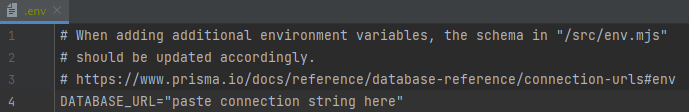
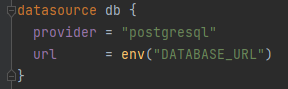

# Create T3 App

This is a [T3 Stack](https://create.t3.gg/) project bootstrapped with `create-t3-app`.

## Motivation
The T3 stack was recommended to me by a colleague. My motivation was not to develop the perfect app,  
but to find out how quick and easy it can be to host an app including database, authentication, styling, etc.

## Initial Setup
```
npm create t3-app@latest
```
Follow the setup:
- Enable packages: prisma, tailwind, trpc
- Create git repository

## Hosting
I used [Vercel](Vercel.com) for the hosting. (free but requires an account)  
Import the repository to Vercel.  
Before we can deploy it for the first time we have to set the Database URL
as an environment variable in Vercel otherwise deployment will fail.

## Database
I chose [Supabase](Supabase.com) as the database provider. (free but requires an account)  
It´s a PostgreSQL DB but any other DB also works.
Get the connection string to your Database.  
For Supabase its located under Settings -> Database -> Connection String (PSQL) and paste it into the .env file of the project:



### Prisma
Prisma is an open source ORM and an additional layer for our database.  
It helps us build and auto generate type-safe queries for Typescript.  
It also comes with Prisma Studio which lets us view and edit our data locally in the DB.  

To make use of it we have to add the specific datasource for the type of DB we´re using: [Prisma docs db-connectors](https://www.prisma.io/docs/concepts/database-connectors)   
We have to change it in the schema.prisma file. This is also where we specify the models of our DB.  
For a PostgreSQL DB it´s this:
###### prisma/schema.prisma  


To sync our DB with the current schema run: 
```
npx prisma db push 
```
Run this everytime the schema has changed.

## First Deployment
After doing this we can deploy the app for the first time.  
Go to [Vercel](Vercel.com) -> Project Settings -> Environment Variables and paste the whole DATABASE_URL string into it.  
Vercel automatically separates the key and value.  
Pick the Environments where the variable should be used.  
For a quickstart just select all three (Prod, Preview, Dev) and save.  

Now deploy. It should run without problems because we did not change much yet.  
Everytime we push to the main branch it automatically redeploys the app.

## Authentication
Now we add authentication methods via [Clerk](clerk.com) (free but requires an account)  
Add an application and choose your desired authentication methods like via 
Google, Microsoft or GitHub or several other methods.  
I chose via GitHub and email address.
###### Add clerk to your project
```
npm install @clerk/nextjs
```

Go to [Clerk Quickstart](https://clerk.com/docs/quickstarts/nextjs) and follow the steps. (Easy to follow, mostly copying into the project)  

Now the application has functioning auth and every component is protected against non-authorized access.

## Routing
To create another page and manage the routing, you simply have to create a new folder in the pages directory with the name that the route should have.  
e.g. we create a user/profile page and want to access it like this: ....com/user/[userId]


## Learn More
To learn more about the [T3 Stack](https://create.t3.gg/), take a look at the following resources:

- [Documentation](https://create.t3.gg/)
- [Learn the T3 Stack](https://create.t3.gg/en/faq#what-learning-resources-are-currently-available)